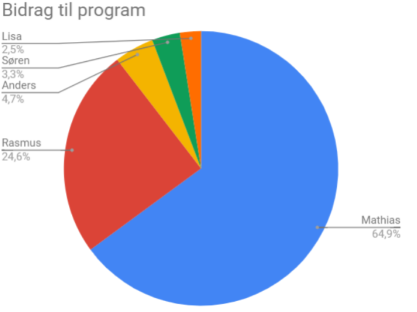
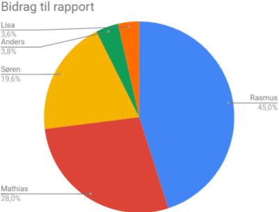

<!-- .element: data-background-video="images/animations/particle.mov" data-background-video-loop="true" data-background-video-muted="true" -->
 

# Procesanalyse

Søren Ravn

---

## Agenda for procesanalysen
- Fravær                        <!-- .element: class="fragment" data-fragment-index="1" -->
- Arbejdsindsats og tilgang     <!-- .element: class="fragment" data-fragment-index="2" -->
- Gruppens samarbejde           <!-- .element: class="fragment" data-fragment-index="3" -->
- Konklusion                    <!-- .element: class="fragment" data-fragment-index="4" -->

---

## Fravær
- Mangel på kommunikation fra fraværende
- Manglende tillid i gruppen
- Løsning halvejs gennem projektet
- Færre møder om ugen

---

## Arbejdsindsats og tilgang
- SCRUM som agenda
- Bidrag til rapporten
- Bidrag til programmet
- Skæv fordeling
- Idéer til fremtiden
  - Forventninger til medlemmer
  - Tidsestimater for opgaver
  - Proaktiv tilgang

---

## Fordeling af arbejde

---

## Gruppens samarbejde
- Godt social samvær
- Samarbejdskontrakten
- Lederrolle
- Vidensdeling
- Kontakt udenfor gruppemøder

---

## Konklusion
- Bedre struktur
- Proaktiv tilgang
- Lederrolle
- Samme mødetider
